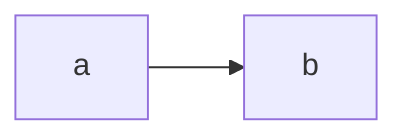

# Phase 1 proof of concept

Two-level bracket, single column, plain text.

```mermaid
---
title: Colossians 3:5–11 (outline)
---
bracket
G
  * S
    5-7
    8
    9a
  G P
    9b
    * 10

5-7: Put to death what is earthly in you.
8: But now you must put them all away.
9a: Do not lie to one another,
9b: seeing that you have put off the old self
10: and have put on the new self.
```

A regular Mermaid diagram must keep working alongside it:



## Exporting

Right-click any bracket diagram for **Copy diagram as PNG** (pastes into Word, Docs, email), **Copy diagram SVG markup** (paste into an `.svg` file or a web page), or **Save diagram as SVG/PNG to vault** (lands in the attachment folder; embed with `![[name.svg]]`). Exports convert the cells to plain SVG text, so the SVG opens in Word, Inkscape and browsers alike; formatting, highlights and colours are preserved.
